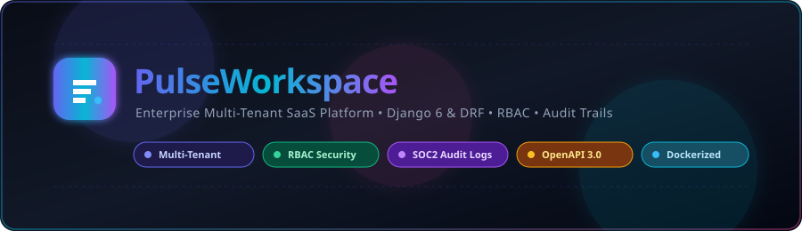
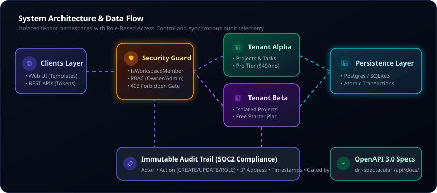
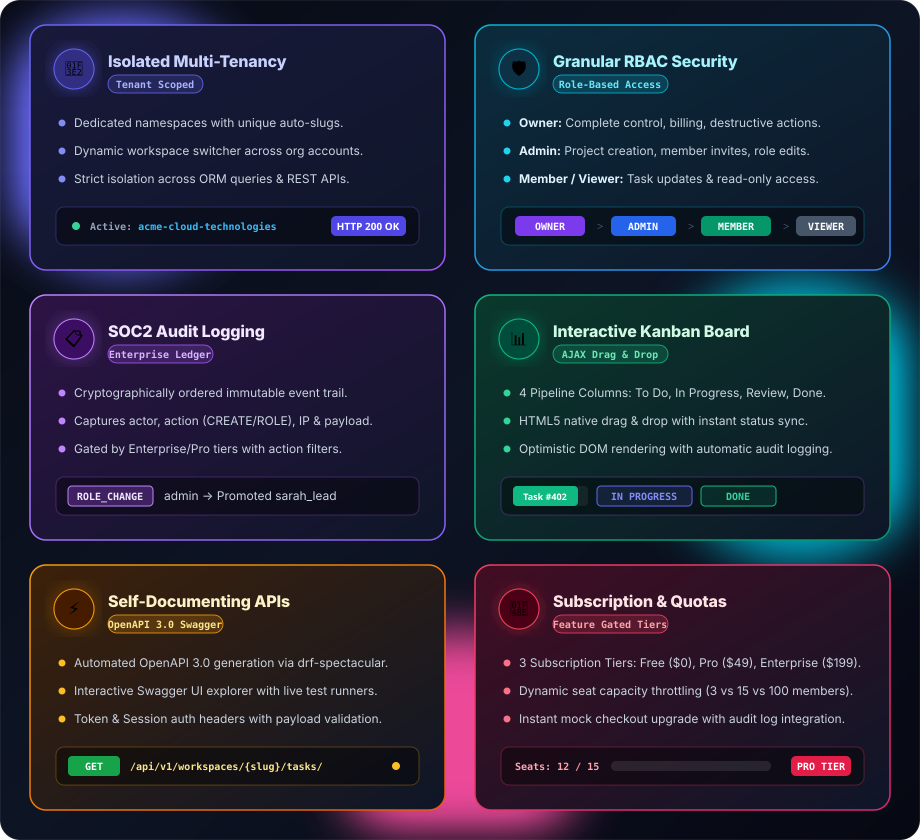
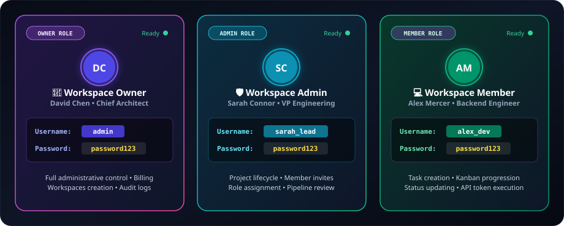
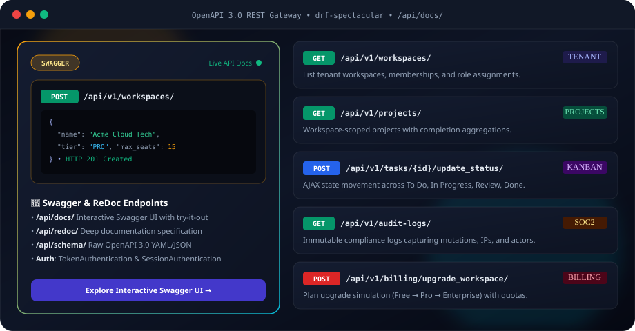
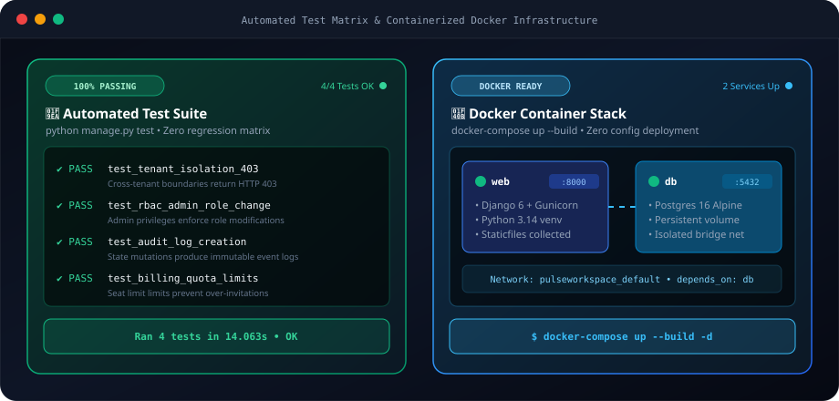

<div align="center">

  <!-- Animated SVG Header Banner -->
  

  <br/><br/>

  <!-- Dynamic Tech & Status Badges -->
  <p align="center">
    
    
    
    
    
    
    
  </p>

  <p align="center">
    <strong>A production-ready, multi-tenant B2B SaaS platform engineered for team collaboration and enterprise scale.</strong>
  </p>

  <!-- Animated Navigation Buttons -->
  <p align="center">
    <a href="#quickstart"></a>
    <a href="#architecture"></a>
    <a href="#features"></a>
    <a href="#api-docs"></a>
    <a href="#demo-accounts"></a>
    <a href="#testing-docker"></a>
  </p>

</div>

---

## 🌟 Executive Summary

**PulseWorkspace** is an enterprise-grade multi-tenant team management and SaaS operations platform built with **Django 6** and **Django REST Framework**. 

Designed for high-velocity software engineering organizations, this platform demonstrates real-world software engineering competencies: **strict tenant data boundaries**, **granular Role-Based Access Control (RBAC)**, **immutable compliance audit trails**, **tiered quota gating**, **automated OpenAPI 3.0 documentation**, and **containerized DevOps readiness**.

---

---

<a id="architecture"></a>
## 🏗️ Architectural Overview & Data Flow

PulseWorkspace enforces a multi-tier defense architecture ensuring that tenant datasets are strictly sandboxed at both ORM and API query execution levels.

<div align="center">
  
</div>

### 🛡️ Core Security Invariants:
1. **Multi-Tenant Scoping**: All projects, tasks, and audit logs are bound to a `Workspace` foreign key.
2. **Permission Guards**: Attempting to query another tenant's slug or identifiers immediately terminates with **`HTTP 403 Forbidden`**.
3. **Atomic Operations**: Workspace initialization, member provisioning, and subscription assignments execute inside `transaction.atomic()` blocks.
4. **Non-Blocking Audit Telemetry**: Auditing uses safe helper logging that captures IP addresses, actors, and diff payloads without blocking critical paths.

---

<a id="features"></a>
## ✨ Key Platform Features

<div align="center">
  
</div>

---

<a id="quickstart"></a>
## ⚡ Quickstart & Local Setup

<div align="center">
  
</div>

<br/>

<details>
<summary><strong>📋 Click to expand copy-pasteable terminal commands</strong></summary>

```bash
# 1. Clone & Setup Virtual Environment
git clone https://github.com/Nivedreddy6/PulseWorkspace-Enterprise-Multi-Tenant-SaaS-Platform.git
cd PulseWorkspace-Enterprise-Multi-Tenant-SaaS-Platform
python -m venv .venv

# Activate environment:
.venv\Scripts\activate          # On Windows
# source .venv/bin/activate     # On Linux/macOS

# 2. Install Dependencies, Migrate & Seed Enterprise Data
pip install -r requirements.txt
python manage.py migrate
python manage.py seed_demo_data

# 3. Launch Local Development Server
python manage.py runserver
```

🌐 *Platform will be immediately live at: `http://127.0.0.1:8000/`*
</details>

---

<a id="demo-accounts"></a>
## 🔑 Pre-Loaded Demo Credentials

<div align="center">
  
</div>

<br/>

<details>
<summary><strong>📋 Click to expand table view of demo credentials</strong></summary>

| Role | Username | Password | Access Capabilities |
| :--- | :--- | :--- | :--- |
| **👑 Workspace Owner** | `admin` | `password123` | Full administrative control, billing upgrades, team management |
| **🛡️ Workspace Admin** | `sarah_lead` | `password123` | Project creation, member invitations, role modifications |
| **💻 Workspace Member** | `alex_dev` | `password123` | Task execution, Kanban board progression, status updates |

</details>

---

<a id="api-docs"></a>
## 📡 Interactive API Documentation

<div align="center">
  
</div>

<br/>

<details>
<summary><strong>📋 Click to expand table view of API endpoints</strong></summary>

| Endpoint | Description |
| :--- | :--- |
| **`/api/docs/`** | Interactive Swagger UI documentation with live testing |
| **`/api/redoc/`** | Beautiful ReDoc API specifications |
| **`/api/schema/`** | Raw OpenAPI 3.0 YAML/JSON schema endpoint |
| **`/api/v1/workspaces/`** | Tenant workspaces, memberships, and role assignments |
| **`/api/v1/projects/`** | Workspace-scoped project tracking |
| **`/api/v1/tasks/`** | Kanban tickets, priority filtering, and status updates |
| **`/api/v1/audit-logs/`** | Enterprise compliance audit trail endpoint |
| **`/api/v1/billing/`** | Subscription tiers and upgrade simulation |

</details>

---

<a id="testing-docker"></a>
## 🧪 Automated Testing & 🐳 Docker Infrastructure

<div align="center">
  
</div>

<br/>

<details>
<summary><strong>📋 Click to view raw test commands & Docker instructions</strong></summary>

### Run Automated Tests:
```bash
python manage.py test
```

### Launch Containerized Stack:
```bash
docker-compose up --build
```

*Web service starts at `http://localhost:8000/` backed by an isolated PostgreSQL 16 container.*
</details>

---

## 📄 License & Attribution

Distributed under the **MIT License**. See `LICENSE` for more information.

<div align="center">
  <sub>Built with ❤️ by an ambitious software engineer to demonstrate enterprise backend &amp; full-stack excellence.</sub>
</div>
